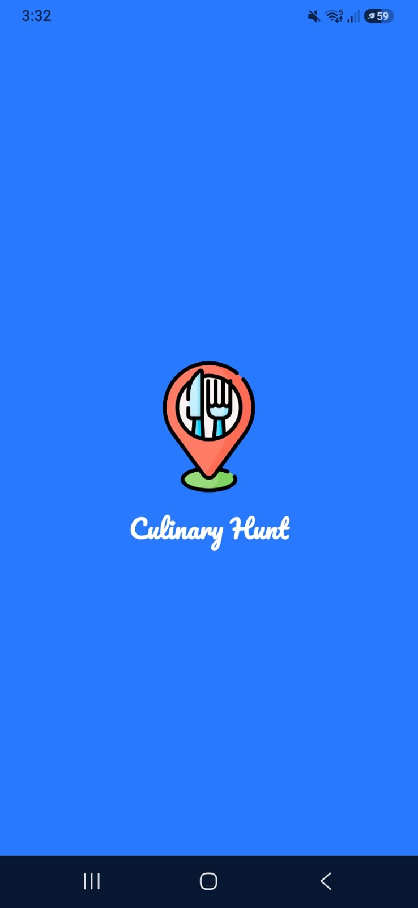
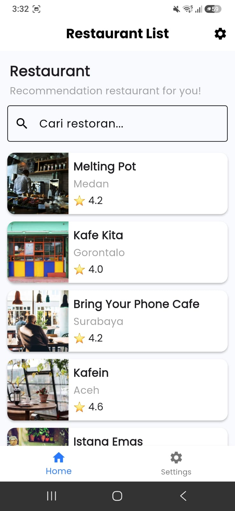
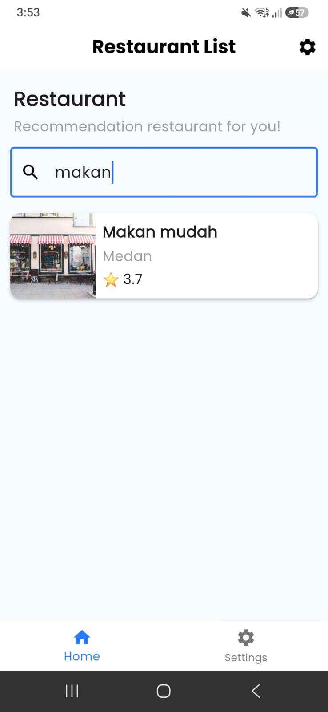
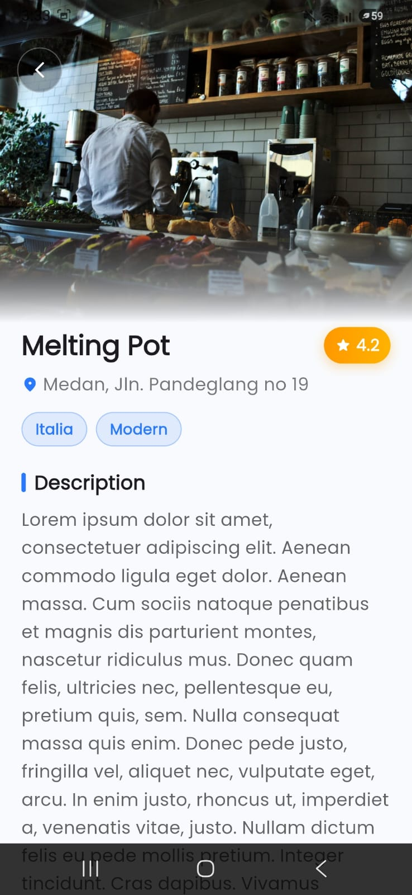
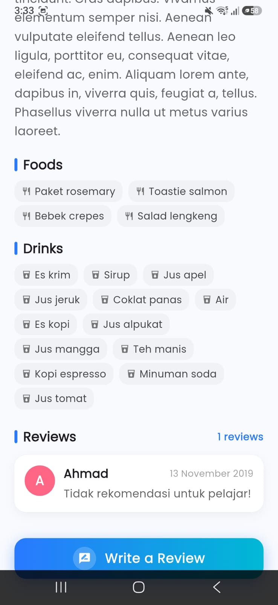
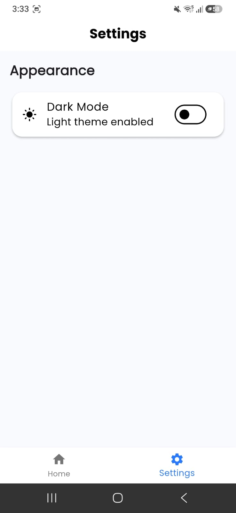

# 🍽️ Culinary Hunt

**Culinary Hunt** is a Flutter-based mobile application that helps users discover, search, and explore restaurants with ease. This project was built as part of the [Dicoding — Belajar Fundamental Aplikasi Flutter](https://www.dicoding.com/academies/195-belajar-fundamental-aplikasi-flutter) course.

---

## ✨ Features

- 🚀 **Splash Screen** — Animated launch screen for a smooth app entry
- 🏠 **List of Restaurants** — Browse a curated list of restaurants with rich details
- 🔍 **Search Restaurants** — Quickly find restaurants by name or menu
- 📋 **Restaurant Detail** — View full details including description, menus, and ratings
- ✍️ **Send Review** — Submit your own review directly from the app
- 🎨 **Advanced Animation** — Smooth and engaging UI transitions and animations
- 🌙 **Dark Mode** — Comfortable viewing experience in low-light environments

---

## 📸 Screenshots

### 1. Splash Screen
<p align="center">
  
</p>

---

### 2. Home
<p align="center">
  
</p>

---

### 3. Search Restaurants
<p align="center">
  
</p>

---

### 4. Detail
<p align="center">
  
</p>

---

### 5. Detail (More)
<p align="center">
  
</p>

---

### 6. Add Review Restaurant
<p align="center">
  
</p>

---

### 7. Settings
<p align="center">
  
</p>

---

## 🛠️ Tech Stack

| Technology | Description |
|---|---|
| [Flutter](https://flutter.dev/) | Cross-platform UI framework |
| [Dart](https://dart.dev/) | Programming language |
| [Provider](https://pub.dev/packages/provider) | State management |
| [HTTP](https://pub.dev/packages/http) | REST API communication |
| [Cached Network Image](https://pub.dev/packages/cached_network_image) | Efficient image loading & caching |
| [Carousel Slider](https://pub.dev/packages/carousel_slider) | Image carousel widget |
| [Smooth Page Indicator](https://pub.dev/packages/smooth_page_indicator) | Page indicator for carousels |
| [Google Fonts](https://pub.dev/packages/google_fonts) | Custom typography |

---

## 🚀 Getting Started

### Prerequisites

- [Flutter SDK](https://docs.flutter.dev/get-started/install) installed
- Android Studio / VS Code with Flutter extension
- A connected device or emulator

### Installation

1. **Clone the repository**
   ```bash
   git clone https://github.com/RachmanForniandi/Culinary_Hunt.git
   cd culinary_hunt
   ```

2. **Install dependencies**
   ```bash
   flutter pub get
   ```

3. **Run the app**
   ```bash
   flutter run
   ```

---

## 📚 Learning Resource

This project was developed as part of the Dicoding course:

> 🎓 [Belajar Fundamental Aplikasi Flutter — Dicoding Indonesia](https://www.dicoding.com/academies/195-belajar-fundamental-aplikasi-flutter)

---

## 📄 License

This project is for educational purposes. Feel free to use it as a reference.

---

<p align="center">Made with ❤️ using Flutter</p>
